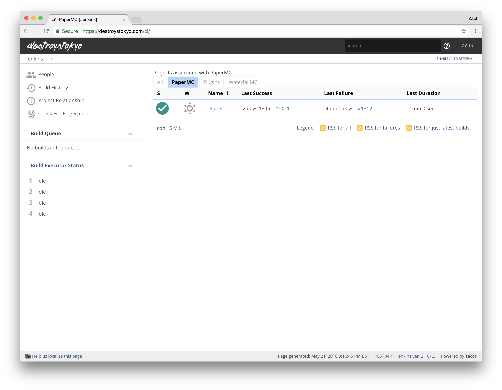

# Jenkins DestroysTokyo Theme


[](https://travis-ci.com/DestroysTokyo/jenkins-destroystokyo-theme)

Beautify your Jenkins with a modern flat theme!

This started as a fork to **jenkins-neo2-theme**, which itself started as a fork
to the **jenkins-neo-theme**, but was developed further to work correctly
with modern versions of Jenkins.


## Features

* Just one css file
* Embed minified SVG images
* Multiple ways to install

## Screenshots



## Development

CSS file are minified and compressed with Grunt. To prepare the environment:

```
npm install
grunt
```

This will generate the following file:

- dist/destroystokyo.css

## Compatibility

- Simple Theme plugin 0.3
- Jenkins 2.7
- Firefox
- Chrome
- Microsoft IE11 and Edge

If you are experiencing issues please let me know! Also, feel free to contribute!

## License

MIT License

## Thanks to

- [Jenkins neo2 theme][neo2] for the inspiration and original work
- [Jenkins neo theme][neo] for the inspiration and original work
- [Jenkins material theme][material] for the inspiration and original work
- [Simple Theme Plugin][simple] for the Simple Theme plugin
- [Google][google] for the the material design inspiration and the icons
- [Material Design Icons][material-design-icons] for some extra icons
- [canon-jenkins][canon-jenkins] for the base theme
- [@Heldroe][heldroe] for Firefox and Microsoft support

[neo2]: https://github.com/TobiX/jenkins-neo2-theme
[neo]: https://github.com/jenkins-contrib-themes/jenkins-neo-theme
[material]: https://github.com/afonsof/jenkins-material-theme
[simple]: https://wiki.jenkins-ci.org/display/JENKINS/Simple+Theme+Plugin
[google]: https://www.google.com/design/spec/material-design/introduction.html
[material-design-icons]: https://materialdesignicons.com/
[canon-jenkins]: https://github.com/rackerlabs/canon-jenkins
[heldroe]: https://github.com/Heldroe
